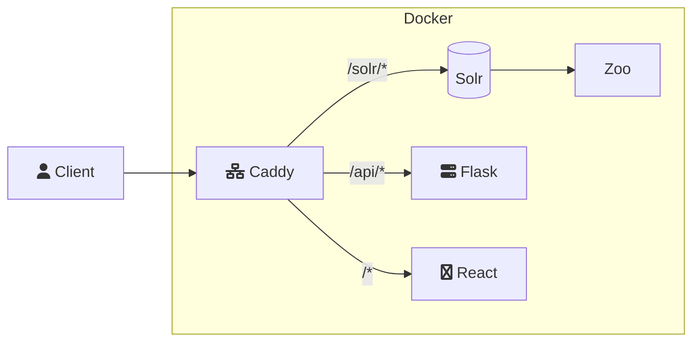

# Information Retrieval Project

This repository contains the project for 2023 CZ4043 Group 31

## Application Structure

There are several moving elements to this application and they are summarised as follows

> - Web app: This is the client that is written in React so that the user can interact with the search engine (`/web-app`). The web app directly communicates with the backend and indexing engine to reduce complexity since the engine is able to directly output data in JSON.
> - Indexing Engine: This is the Solr Server that is running that allows the data to be searched and the relevant information to be retrieved.
> - Backend: This is a Flask Server that runs the crawler script which fetches new data when requested. It scrapes specific sites like [Cars.com](https://cars.com) for additional data (`/backend`).
> - ML Model: This is a RoBERTa model that has been fine tuned on large sentiment datasets and then further fine tuned by us specifically for the cars dataset. This follows the principle of task-specific training followed by domain-specific training as highlighted in [this paper](https://arxiv.org/abs/1905.05583) (`/classification`).
> Caddy: This is a reverse proxy that is used to avoid CORS errors.
> Docker: Used to run all the applications.

A visual representation is as follows,



## Requirements

You will need Docker in order to run the application. The commands are

```bash
docker compose up -d
```

To stop the containers run

```bash
docker compose stop
```

To delete the images run

```bash
docker compose down
```

## Initial Setup

1. Start the containers with the docker command above.
2. Navigate to the [Solr Server](http://localhost/solr/).
3. Create a new collection called `info_retrieval`.
4. Upload the `data.csv` file found at the root directory to this collection
   1. Go to the collection.
   2. Go to the `Documents` section
   3. Change Document type to File upload
   4. Select the csv file and then press submit
5. Navigate to the [Homepage](http://localhost) of the app.

## Explanation of Files

> - data.csv: The fully processed data that is to be loaded into the Solr server for consumption.
> - docker-compose.yml: The compose file to spin up all the project containers.
